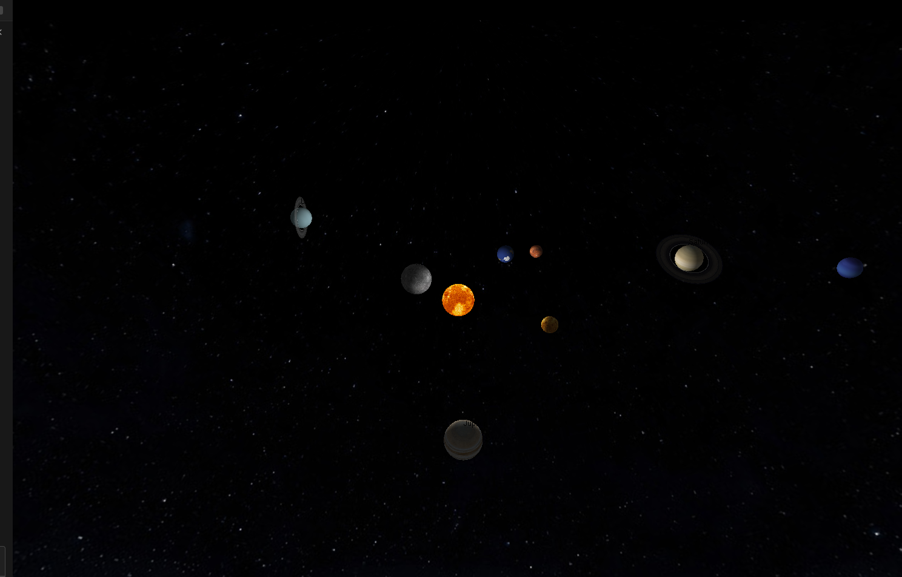

# Sistema Solar em OpenGL

## Descrição

Este projeto foi desenvolvido para a disciplina de Computação Gráfica e consiste na implementação de uma simulação tridimensional do sistema solar utilizando OpenGL com a biblioteca GLUT. O sistema apresenta os planetas orbitando o Sol.

A cena inclui iluminação, aplicação de texturas e controle de câmera em tempo real. O Sol atua como fonte de luz do ambiente, influenciando diretamente a aparência dos demais corpos celestes.

## Demonstração



## Compilação e execução

Em sistemas Linux, o projeto pode ser compilado com o seguinte comando:

```bash
gcc solar_system.c -o solar_system -lGL -lGLU -lglut -lm && ./solar_system
```

Em sistemas Windows com MinGW, recomenda-se utilizar:

```bash
gcc solar_system.c -o solar_system.exe -lopengl32 -lglu32 -lfreeglut -lm
solar_system.exe
```

## Controles

### Simulação
`[` → diminui a velocidade das órbitas
`]` → aumenta a velocidade das órbitas
`r` → reset geral (câmera + velocidade)
### Câmera
`←` `→` → rotaciona ao redor do Sol
`↑` `↓` → inclinação vertical da câmera
`+` → zoom in
`-` → zoom out
### Geral
`ESC` → sair

## Conceitos implementados

O projeto explora diversos conceitos fundamentais de computação gráfica. Foram utilizadas transformações geométricas como translação, rotação e escala para posicionamento e animação dos planetas. A visualização é realizada por meio de projeção em perspectiva com a função `gluPerspective`, e a câmera é controlada utilizando `gluLookAt`.

A iluminação é baseada no modelo padrão do pipeline fixo do OpenGL, com o Sol definido como uma fonte de luz pontual. As superfícies dos planetas utilizam texturas carregadas a partir de arquivos no formato PPM, com aplicação em superfícies esféricas, incluindo ajustes de rotação para correto alinhamento nos eixos. Além disso, foi implementado um fundo estrelado utilizando uma esfera de grande escala com textura aplicada internamente, simulando o ambiente espacial ao redor do sistema solar. 

O movimento orbital é implementado com interpolação por curvas, garantindo trajetórias suaves ao longo do tempo.

## Problemas encontrados

TEXTURA 

Durante o desenvolvimento, um dos principais problemas encontrados foi o alinhamento incorreto da textura da Terra, que inicialmente aparecia “torta” em relação ao eixo do planeta. Esse comportamento ocorreu devido à orientação padrão do mapeamento de textura em esferas (GLUquadric), que nem sempre coincide com a orientação esperada da imagem utilizada.
Para contornar esse problema, foi necessário realizar ajustes de rotação no objeto, alinhando corretamente a textura com os eixos do modelo. Esse processo exigiu testes iterativos até encontrar a orientação adequada, evidenciando a importância do controle de transformações na etapa de texturização.
Um problema similar foi encontrado ao mapear a textura dos anéis de Saturno e Urano, os quais aparentavam ser estriadas de forma paralela. Os anéis precisaram ter as suas texturas mapeadas de uma imagem retangular ao formato de disco desejado e esticados para fazer a volta completa com listras radiais.

## Possíveis melhorias

Como evolução do projeto, pretende-se aprimorar a qualidade visual e a fidelidade física da simulação. Entre as melhorias possíveis está a migração do pipeline fixo para o uso de shaders GLSL, permitindo a implementação de sombreamento por pixel (Phong) e maior controle sobre os efeitos de iluminação.

Também pode ser incorporado suporte a transparência real baseada em textura com canal alpha, substituindo a abordagem atual baseada apenas em blending global. Outra melhoria relevante seria a implementação de sombras projetadas entre os corpos celestes, utilizando técnicas como shadow mapping.

Adicionalmente, pode-se aprimorar a interação com o usuário por meio de controle de câmera com mouse e navegação mais intuitiva, bem como introduzir escalas físicas mais realistas para distâncias, tamanhos e velocidades orbitais.

## Elementos das atividades práticas

### Visualização
Os astros são renderizados dinamicamente por intermédio da função renderPlanet(), que resgata as informações da variável global planetas.

### Visibilidade
A visibilidade no projeto é implementada através da câmera, inicialmente distante e focada no Sol, que é móvel por meio das interações do teclado, podendo explorar novos ângulos da câmera.

### Iluminação e Sombreamento
Neste projeto, a iluminação foi implementada utilizando o pipeline fixo do OpenGL, com uma fonte de luz pontual posicionada na origem da cena, representando o Sol. Essa luz afeta todos os planetas, que são renderizados com materiais que respondem aos componentes ambiente, difuso e especular da iluminação. O Sol, por sua vez, utiliza emissão própria, de modo que sua aparência não depende da luz da cena, simulando um corpo luminoso.

O sombreamento é controlado pelo modelo GL_SMOOTH, que utiliza interpolação de cores entre os vértices das superfícies, caracterizando o método de Gouraud shading. As normais das superfícies esféricas são calculadas automaticamente pelas primitivas da GLU, permitindo uma transição suave entre áreas iluminadas e não iluminadas.

### Mapeamento de texturas
Neste projeto, a texturização foi implementada utilizando o pipeline fixo do OpenGL, com aplicação de imagens sobre superfícies geométricas para representar os corpos celestes. As texturas são carregadas a partir de arquivos no formato PPM (P6) por meio de uma função própria, que realiza a leitura dos dados RGB e os envia para a GPU utilizando glTexImage2D, além de configurar parâmetros como interpolação linear e repetição.

As superfícies esféricas dos planetas e do Sol utilizam GLUquadric com mapeamento automático de textura, permitindo que as imagens sejam distribuídas corretamente ao longo da geometria. O céu é representado por uma esfera invertida texturizada, criando o efeito de fundo espacial.

Além disso, os anéis de Saturno e Urano são renderizados manualmente com GL_TRIANGLE_STRIP, utilizando coordenadas de textura parametrizadas e transparência, o que permite simular estruturas finas e translúcidas. No caso do Sol, a textura é combinada com emissão de luz, garantindo que sua aparência seja independente da iluminação da cena.

### Curvas paramétricas
A movimentação dos astros foi implementada por intermédio do uso de uma spline cíclica de Catmull-Rom, utilizando oito pontos para garantir uma maior suavidade na movimentação. Cada planeta possui uma curva própria, atributo do struct Planeta, indicando a sua curva, aumentando progressivamente para cada astro. A posição dos planetas é calculada dinamicamente utilizando da função catmullRom(), que implementa a fórmula utilizada.

Os oito pontos representam, respectivamente: 
1. Direita (extremo da elipse)
2. Canto superior direito
3. Topo
4. Canto superior esquerdo
5. Esquerda (extremo)
6. Canto inferior esquerdo
7. Baixo
8. Canto inferior direito

## Integrantes do grupo

#### Josué Guedes Ferreira - 20230012313
Responsável pela implementação da movimentação dos planetas por meio das curvas paramétricas, renderização inicial dos planetas, coordenação do grupo e configuração inicial da câmera, além da criação das estruturas de dados básicas do projeto como Planeta.

#### Lael Gustavo Batista Ribeiro de Lima - 20230021715
Responsável pela implementação da iluminação com o Sol como fonte emissora, configuração do modelo de sombreamento (Gouraud), controle interativo da simulação (velocidade e câmera), além do desenvolvimento do sistema de anéis planetários com suporte a orientação arbitrária, transparência e mapeamento de textura radial.

#### Matheus Lobato Hora Macedo - 20220137889 
Responsável pela implementação da texturização dos planetas e do Sol. Também realizou ajustes de rotação nas texturas para garantir o alinhamento correto nos eixos dos objetos. Além disso, desenvolveu o fundo estrelado da cena utilizando uma esfera de grande escala que engloba todo o sistema solar, com textura aplicada internamente para simular o ambiente espacial.
