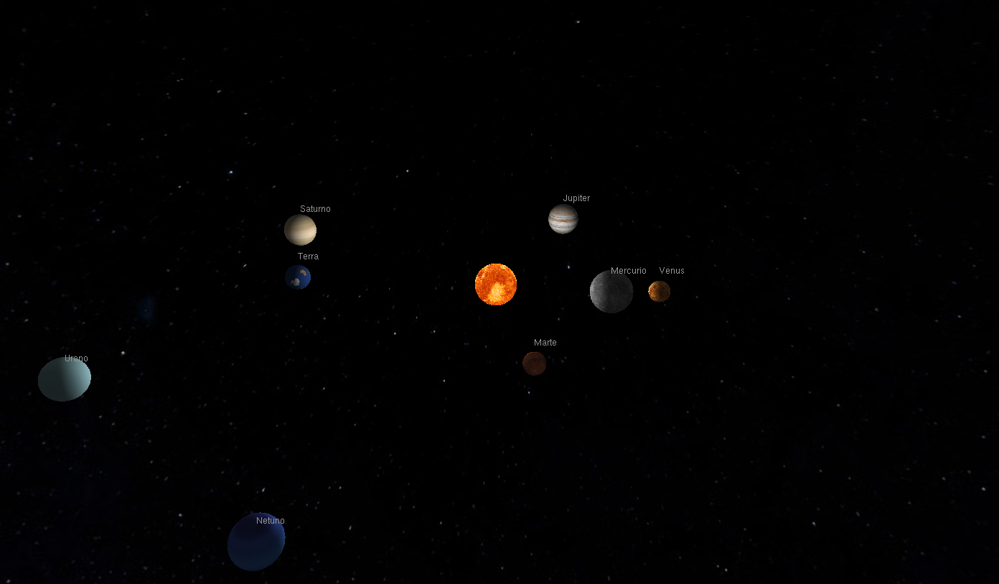

# Sistema Solar em OpenGL

## Descrição

Este projeto foi desenvolvido para a disciplina de Computação Gráfica e consiste na implementação de uma simulação tridimensional do sistema solar utilizando OpenGL com a biblioteca GLUT. O sistema apresenta os planetas orbitando o Sol.

A cena inclui iluminação, aplicação de texturas e controle de câmera em tempo real. O Sol atua como fonte de luz do ambiente, influenciando diretamente a aparência dos demais corpos celestes.

## Demonstração



## Compilação e execução

Em sistemas Linux, o projeto pode ser compilado com o seguinte comando:

```bash
gcc solar_system.c -o solar_system -lGL -lGLU -lglut -lm && ./solar_system
```

Em sistemas Windows com MinGW, recomenda-se utilizar:

```bash
gcc solar_system.c -o solar_system.exe -lopengl32 -lglu32 -lfreeglut -lm
solar_system.exe
```

## Controles

### Simulação
`[` → diminui a velocidade das órbitas
`]` → aumenta a velocidade das órbitas
`r` → reset geral (câmera + velocidade)
### Câmera
`←` `→` → rotaciona ao redor do Sol
`↑` `↓` → inclinação vertical da câmera
`+` → zoom in
`-` → zoom out
### Geral
`ESC` → sair

## Conceitos implementados

O projeto explora diversos conceitos fundamentais de computação gráfica. Foram utilizadas transformações geométricas como translação, rotação e escala para posicionamento e animação dos planetas. A visualização é realizada por meio de projeção em perspectiva com a função `gluPerspective`, e a câmera é controlada utilizando `gluLookAt`.

A iluminação é baseada no modelo padrão do pipeline fixo do OpenGL, com o Sol definido como uma fonte de luz pontual. As superfícies dos planetas utilizam texturas carregadas a partir de arquivos no formato PPM. O movimento orbital é implementado com interpolação por curvas, garantindo trajetórias suaves ao longo do tempo.

## Problemas encontrados

TBD

## Possíveis melhorias

Como evolução do projeto, é possível expandir a simulação com a inclusão de satélites naturais, anéis planetários e efeitos de sombra entre os corpos celestes. Melhorias na interface de interação, como suporte ao uso de mouse, e ajustes nas proporções físicas do sistema também podem ser considerados.

TBD

## Elementos das atividades práticas

### Visualização
TBD

### Visibilidade
TBD

### Iluminação e Sombreamento
Neste projeto, a iluminação foi implementada utilizando o pipeline fixo do OpenGL, com uma fonte de luz pontual posicionada na origem da cena, representando o Sol. Essa luz afeta todos os planetas, que são renderizados com materiais que respondem aos componentes ambiente, difuso e especular da iluminação. O Sol, por sua vez, utiliza emissão própria, de modo que sua aparência não depende da luz da cena, simulando um corpo luminoso.

O sombreamento é controlado pelo modelo GL_SMOOTH, que utiliza interpolação de cores entre os vértices das superfícies, caracterizando o método de Gouraud shading. As normais das superfícies esféricas são calculadas automaticamente pelas primitivas da GLU, permitindo uma transição suave entre áreas iluminadas e não iluminadas.

### Mapeamento de texturas
TBD

### Curvas paramétricas
TBD

## Integrantes do grupo

#### Josué Guedes Ferreira - 20230012313
TBD

#### Lael Gustavo Batista Ribeiro de Lima - 20230021715
Encarregado da parte de iluminação, sombreamento e input do usuário.

#### Matheus Lobato Hora Macedo - 20220137889 
TBD
